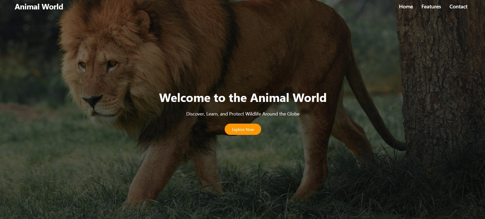
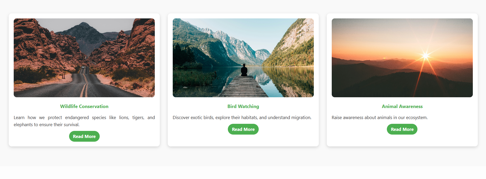

# Animal World 🐻🐨 

---

A responsive and interactive landing page dedicated to wildlife education, conservation awareness, and animal facts. Built with pure HTML, CSS, and JavaScript.

## Live Demo

[View the Live Project] (https://git-animal-world.netlify.app/)

## Features

- **Fully Responsive Design:** Adapts seamlessly to desktop, tablet, and mobile screens.
- **Interactive Elements:**
  - "Read More / Read Less" buttons to expand and collapse text content.
  - A modal popup featuring a playable YouTube video.
- **Performance Optimized:**
  - **Lazy Loading:** Off-screen images are loaded only when needed for faster initial page load.
  - **Preloading:** The critical hero image is preloaded to improve perceived performance.
- **Modern CSS Layouts:** Utilizes both CSS Flexbox and CSS Grid for a clean and maintainable layout.
- **Semantic HTML5:** Uses modern HTML5 tags for better accessibility and SEO.
- **Smooth Animations:** Includes hover effects and transitions for a polished user experience.

## Technologies Used

- **HTML5:** Semantic structure, preloading, and lazy loading attributes.
- **CSS3:** Flexbox, Grid, animations, transitions, gradients, and media queries for responsiveness.
- **JavaScript:** DOM manipulation, event handling, and dynamic content creation (iframe injection) without any external libraries.

### Key Concepts Demonstrated
- **DOM Manipulation:** Selecting elements, changing styles, and toggling content.
- **Event Handling:** Click events for buttons and modal controls.
- **CSS Architecture:** Box-model management, positioning (absolute, fixed, relative), and responsive breakpoints.
- **Web Performance:** Implementation of lazy loading and resource preloading strategies.

## 📸 Screenshots

  
  
  

