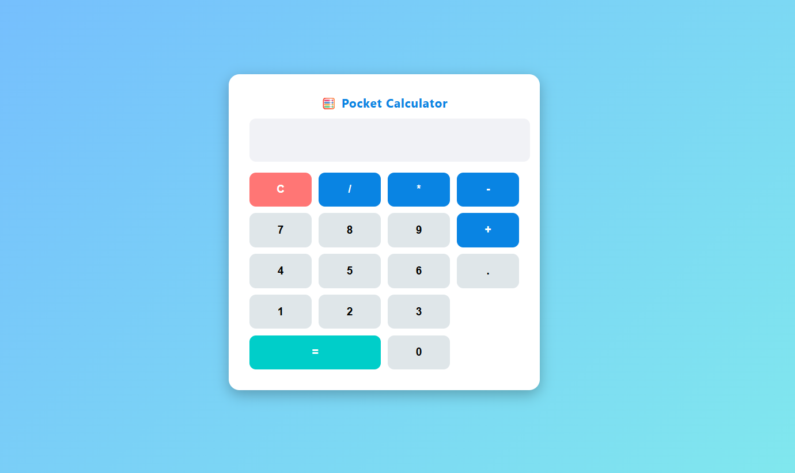

## 🛠️ Pocket Calculator
---

## 🛠️ Technologies Used
- **HTML5** → Structure  
- **CSS3** → Styling, Grid layout for buttons  
- **JavaScript (ES6)** → Logic & Event Handling  

---

## 🎯 Learning Objectives
This project helped me practice:
- Using **event listeners** for button clicks  
- Applying **if-else statements** for input handling  
- Implementing arithmetic **operators**  
- Using **loops** to process expressions  

---

## 📸 Screenshot
  

---

## 🔗 Live Demo
[Click here to view live demo](https://68a33e280718ca3be0a07cd2--loquacious-mochi-c9fabc.netlify.app/)  

---

## ✨ Author
**Gitanjali Singh**  

